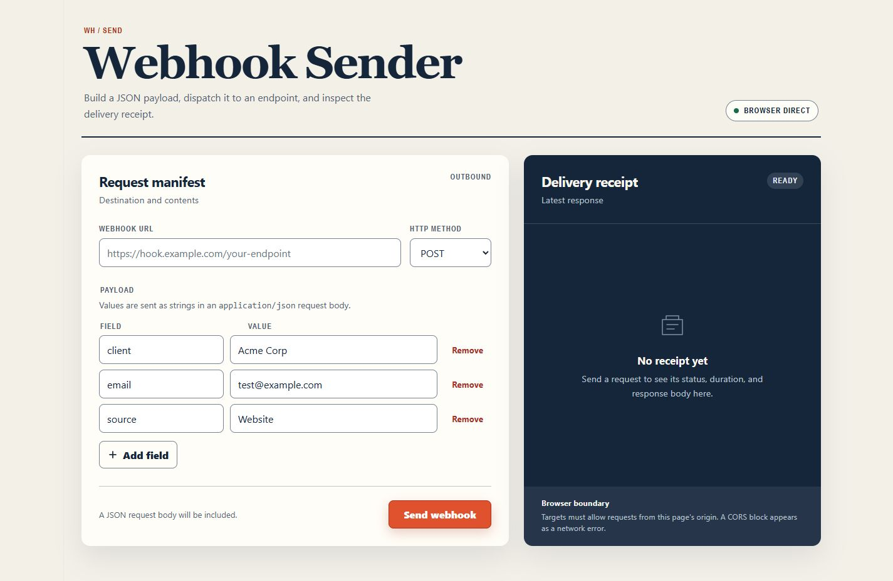

# Webhook Sender

A lightweight browser-based tool for building and sending webhook requests without opening DevTools and writing `fetch()` manually every time.

Built with vanilla HTML, CSS, and JavaScript.



## Why I Built This

While testing Make and n8n workflows, I often needed to manually run webhook requests from the browser console.

That worked, but repeatedly editing the endpoint, HTTP method, and JSON payload became inconvenient.

Webhook Sender turns that process into a simple visual interface.

## Features

- Editable webhook URL
- Supports:
  - GET
  - POST
  - PUT
  - PATCH
  - DELETE
- Dynamic key/value payload fields
- Add and remove fields
- Converts form fields into JSON
- Detects empty field names
- Detects duplicate field names
- Automatically suppresses request bodies for GET requests
- Displays:
  - HTTP status
  - Status text
  - Request duration
  - Response body
  - HTTP errors
  - Network errors
- Formats JSON responses when possible
- Responsive desktop and mobile layout

## How It Works

```text
Webhook URL + Method + Payload Fields
                 ↓
             Validation
                 ↓
         Build JSON Payload
                 ↓
          Send HTTP Request
                 ↓
        Receive HTTP Response
                 ↓
       Display Delivery Receipt
```

The project is split into small modules:

```text
webhook-sender/
├── index.html
├── styles.css
├── dev-server.mjs
├── js/
│   ├── app.js
│   ├── payload.js
│   ├── request.js
│   └── ui.js
├── tests/
│   ├── run-tests.mjs
│   └── screenshots/
├── DESIGN.md
├── PRODUCT.md
├── package.json
└── README.md
```

### Module Responsibilities

- `app.js` — coordinates the application flow
- `payload.js` — validates and builds payload data
- `request.js` — handles HTTP requests and responses
- `ui.js` — manages interface updates and request states

## Running Locally

Clone the repository:

```bash
git clone <your-repository-url>
cd webhook-sender
```

Start the local server:

```bash
npm start
```

Then open the local URL shown in the terminal. By default, the application runs at `http://127.0.0.1:4173`.

No package installation is required because the project has no external runtime dependencies.

## Example

Input:

```text
URL:
https://example.com/webhook

Method:
POST

Payload:
client    Acme Corp
email     test@example.com
source    Website
```

Generated request body:

```json
{
  "client": "Acme Corp",
  "email": "test@example.com",
  "source": "Website"
}
```

## Testing

The project includes automated tests for the core payload and request behavior.

Run the tests with:

```bash
npm test
```

Current test result:

```text
9 / 9 tests passing
```

Manual testing also covered:

- Adding and removing fields
- GET body suppression
- Loading state
- Successful requests
- Validation errors
- HTTP errors
- Network errors
- Long response bodies
- Responsive desktop and mobile layouts

## Browser Limitation

Webhook Sender sends requests directly from the browser.

Because of this, target endpoints must allow requests from the page's origin.

Some endpoints may fail because of browser CORS restrictions even if the endpoint itself is working correctly.

This project intentionally remains browser-only for the current version.

## Current Limitations

- Payload values are sent as strings
- No custom request headers yet
- No saved endpoints or presets
- No request history
- Browser CORS rules still apply

## Possible Extensions

These are optional ideas, not current requirements:

- Custom headers
- Typed values such as numbers, booleans, and `null`
- Saved webhook presets
- Request history
- Generate equivalent `fetch()` code
- Node.js proxy mode for endpoints blocked by CORS

## What I Learned

This project helped me practice:

- Modular JavaScript architecture
- HTTP request construction
- Dynamic form interfaces
- Input validation
- JSON payload generation
- Browser networking
- CORS limitations
- Asynchronous request handling
- Error states
- Basic automated testing
- Separating UI logic from request and data logic

## Tech Stack

- HTML5
- CSS3
- Vanilla JavaScript
- Fetch API
- Node.js test and local-server tooling

## Status

**Completed**

The core goal of the project is finished: quickly build, send, and inspect webhook requests without relying on temporary DevTools scripts.
